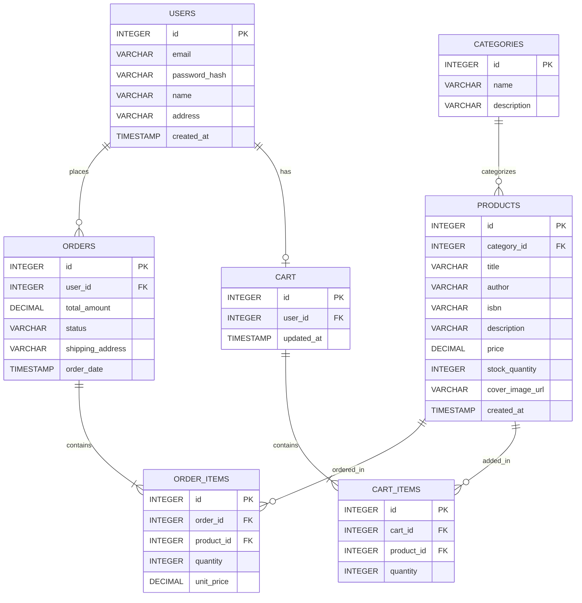

# Sprint 1: Architecture & Scope Definition

## 1. Target Audience & Market Focus

**Project Name:** PageHaven — an online bookstore

**Primary Persona:** Retail consumers — students and working professionals (ages 18–35) who read regularly and want a simple, reliable way to browse and buy books online, without wading through a huge generic marketplace like Amazon.

**Core Pain Point:** Local/independent bookstores mostly sell in-person or take orders manually over phone/WhatsApp — there's no searchable catalog, cart, or order tracking. Buyers can't easily browse by genre/author, check stock, or track their order status online.

**Domain Scope:** Books & Publications — a focused retail vertical covering categories such as Fiction, Non-Fiction, Academic, and Children's books.

---

## 2. Minimum Viable Product (MVP) Feature Scope

| Category | Feature Name | Description | Priority |
|---|---|---|---|
| Authentication | User Registration & Authentication | Password hashing and JWT-based authentication mechanism for buyer accounts. | High (MVP) |
| Catalog | Book List & Search | Book browsing interface with genre/author-based filtering and keyword search. | High (MVP) |
| Cart | Cart Management | State-persistent cart management (item addition, quantity modification, and deletion). | High (MVP) |
| Checkout | Order Processing | Mock payment gateway integration and order object instantiation upon checkout. | High (MVP) |
| Admin | Inventory Control | Administrative CRUD operations for book inventory (add/update/remove titles, stock counts). | Medium |
| Order Management | Order History & Status | Buyers can view past orders and track current status (pending/shipped/delivered). | Medium |

---

## 3. Tech Stack Selection & Justification

- **Frontend Framework:** React
  **Justification:** React's component-based architecture suits a catalog-driven UI (book cards, cart rows, filter sidebars), and its large ecosystem makes it practical to build and debug solo within a single academic semester.

- **Backend Infrastructure:** Node.js / Express.js
  **Justification:** Express provides a lightweight REST API layer with fast setup time. Using JavaScript across both frontend and backend reduces context-switching compared to a split-language stack (e.g., React + Django), which matters for a solo, time-boxed project.

- **Database Management System:** PostgreSQL
  **Justification:** Core entities (Users, Books, Orders) have strict foreign-key relationships and need transactional integrity — an order must reliably map to its items and total. PostgreSQL's relational model and ACID compliance handle this more cleanly than a schema-less NoSQL store like MongoDB, which would require manual consistency handling.

- **Caching & Asynchronous Processing (Optional):** Redis
  **Justification:** Redis can cache frequently-read data such as the book catalog and genre lists to reduce database load, and can back session/cart persistence for logged-in users as the catalog grows.

---

## 4. Entity-Relationship Diagram (ERD)

**Keys & Cardinality:**
- `USERS.id` (PK) → `ORDERS.user_id` (FK): one user places many orders (1:N)
- `USERS.id` (PK) → `CART.user_id` (FK): one user has one cart (1:1)
- `CATEGORIES.id` (PK) → `PRODUCTS.category_id` (FK): one category (genre) groups many books (1:N)
- `ORDERS.id` (PK) → `ORDER_ITEMS.order_id` (FK), `PRODUCTS.id` (PK) → `ORDER_ITEMS.product_id` (FK): `ORDER_ITEMS` is the associative entity resolving the N:M relationship between Orders and Books
- `CART.id` (PK) → `CART_ITEMS.cart_id` (FK), `PRODUCTS.id` (PK) → `CART_ITEMS.product_id` (FK): `CART_ITEMS` is the associative entity resolving the N:M relationship between Cart and Books
